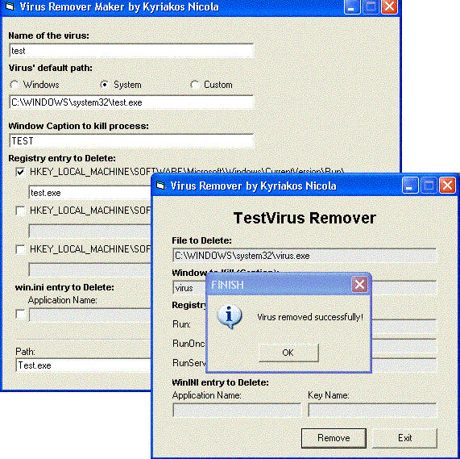



## Virus Remover Maker

### Description

I wrote this project because viruses are increasing dramatically and are becoming more and more everyday and I wanted to give a hand to fight them, not that this project will exinquish all the viruses but at least it can be developed by many programmers and become a great tool for removing new viruses. Please respect my work, leave comments(important!) and if you like it vote for it.
 
### More Info
 

             |
---                |---
**Submitted On**   |2003-11-08 23:08:36
**By**             |[Kyriakos Nicola](https://github.com/Planet-Source-Code/PSCIndex/blob/master/ByAuthor/kyriakos-nicola.md)
**Level**          |Intermediate
**User Rating**    |4.6 (23 globes from 5 users)
**Compatibility**  |VB 5\.0, VB 6\.0, VB Script
**Category**       |[Miscellaneous](https://github.com/Planet-Source-Code/PSCIndex/blob/master/ByCategory/miscellaneous__1-1.md)
**World**          |[Visual Basic](https://github.com/Planet-Source-Code/PSCIndex/blob/master/ByWorld/visual-basic.md)
**Archive File**   |[Virus\_Remo16704711102003\.zip](https://github.com/Planet-Source-Code/kyriakos-nicola-virus-remover-maker__1-49811/archive/master.zip)

